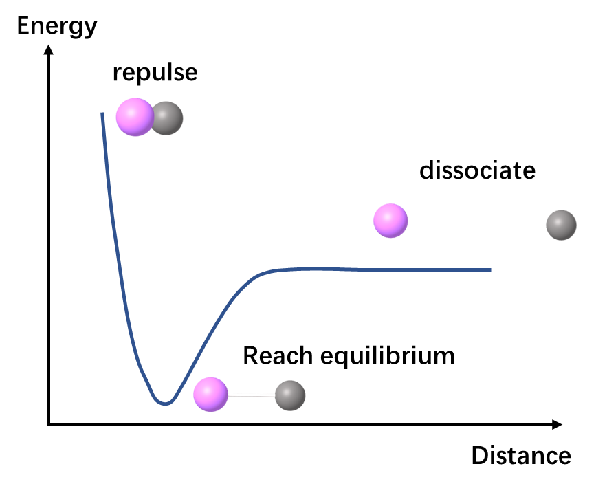
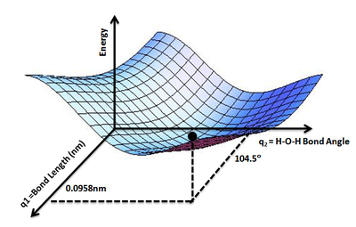
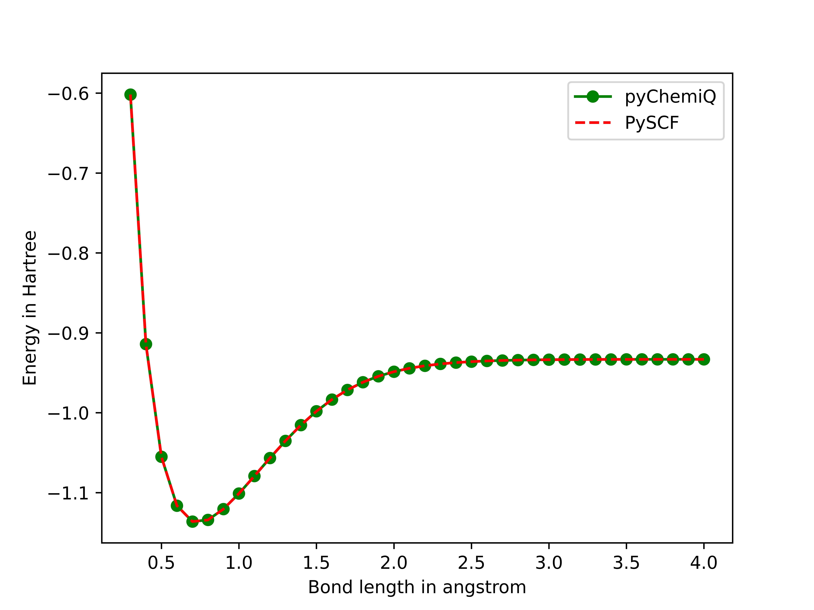

Functional Tutorials
=================================

It is well known that the essence of a chemical reaction lies in the breaking of existing chemical bonds and the formation of new ones. However, the terms "bond breaking" and "bond formation" represent only qualitative macroscopic descriptions. In reality, we describe a bond as "formed" because atoms move closer along the reaction coordinate, reaching a specific relative configuration where the system's energy is minimized and stability is maximized. Conversely, "bond breaking" occurs when external energy input enables atoms to overcome an energy barrier and move apart along the reaction coordinate. In computational chemistry, the potential energy curve serves as a critical tool to map molecular energy variations across different atomic configurations, thereby elucidating the progression of chemical reactions.

.. centered:: Figure 1: Potential energy surface of bimolecular atoms

For example, as the length of a specific bond within a molecule increases, the energy changes accordingly. The plot of energy against bond length is called a potential energy curve, as shown in Figure 1. If we plot the molecule's potential energy as a function of two coordinate parameters, the resulting graph forms a surface—since three quantities (the two coordinate variables and energy) define a three-dimensional space—known as a potential energy surface (PES), illustrated in Figure 2. Extending this concept further, the potential energy of an entire molecule, varying with all possible atomic coordinate parameters, constitutes a complex hypersurface in a high-dimensional space. This generalized construct is collectively referred to as the potential energy surface [1]_.

.. centered::  Figure 2: Water molecule potential energy surface: The lowest point of potential energy corresponds to the optimized water molecule structure, with an O-H bond length of 0.0958 nm and an H-O-H angle of :math:`104.5^{\circ}`. Figure cited from [2]_

In this tutorial, we will demonstrate how to obtain molecular potential energy surface (PES) data using pyChemiQ and visualize it with matplotlib. Using the diatomic hydrogen molecule :math:`H_2` as an example, we employ the Jordan-Wigner (JW) transformation for qubit mapping, the UCCSD ansatz, and the SLSQP classical optimizer. Finally, we compare the potential energy curve generated by pyChemiQ against the one calculated with PySCF.

.. code-block::

    # Import the required package
    from pychemiq import Molecules,ChemiQ,QMachineType
    from pychemiq.Transform.Mapping import jordan_wigner,MappingType
    from pychemiq.Optimizer import vqe_solver
    from pychemiq.Circuit.Ansatz import UCC
    import numpy as np
    from pyscf import gto, scf, fci
    import matplotlib.pyplot as plt

    # Perform potential energy surface scanning: initialize electronic structure parameters of molecules first, then construct molecular systems with different bond lengths, and perform multiple single point energy calculations
    basis = 'sto-3g'
    multiplicity = 1
    charge=0

    ## Define the step size and number of steps
    bond_length_interval = 0.1
    n_points = 40
    bond_lengths = []
    energies = []
    for point in range(3, n_points + 1):
        bond_length = bond_length_interval * point
        bond_lengths += [bond_length]
        geometry = ["H 0 0 0", f"H 0 0 {bond_length}"]
    
        mol = Molecules(
            geometry = geometry,
            basis    = basis,
            multiplicity = multiplicity,
            charge = charge)
    
        fermion_H2 = mol.get_molecular_hamiltonian()
        pauli_H2 = jordan_wigner(fermion_H2)
    
        chemiq = ChemiQ()
        machine_type = QMachineType.CPU_SINGLE_THREAD
        mapping_type = MappingType.Jordan_Wigner
        pauli_size = len(pauli_H2.data())
        n_qubits = mol.n_qubits
        n_elec = mol.n_electrons
        chemiq.prepare_vqe(machine_type,mapping_type,n_elec,pauli_size,n_qubits)
        ansatz = UCC("UCCSD",n_elec,mapping_type,chemiq=chemiq)
    
        method = "SLSQP"
        init_para = np.zeros(ansatz.get_para_num())
        solver = vqe_solver(
                method = method,
                pauli = pauli_H2,
                chemiq = chemiq,
                ansatz = ansatz,
                init_para=init_para)
        energy = solver.fun_val
        energies += [energy]

    # Use the Full Configuration Interaction (FCI) method in the computational chemistry software PySCF to calculate the energy of the hydrogen molecule at various bond lengths
    pyscf_energies = []
    bond_length_interval = 0.1
    n_points = 40
    for point in range(3, n_points + 1):
        bond_length = bond_length_interval * point
        atom = f'H 0 0 0; H 0 0 {bond_length}'
    
        mol = gto.M(atom=atom,   # in Angstrom
                basis='STO-3G',
                charge=0,
                spin=0)
        myhf = scf.HF(mol).run() 
        cisolver = fci.FCI(myhf) 
        pyscf_energies += [cisolver.kernel()[0]]

    # Finally, we plot potential energy curve of hydrogen molecule's using matplotlib
    plt.figure()
    plt.plot(bond_lengths, energies, '-g',label='pyChemiQ')
    plt.plot(bond_lengths, pyscf_energies, '--r',label='PySCF')
    plt.ylabel('Energy in Hartree')
    plt.xlabel('Bond length in angstrom')
    plt.legend()
    plt.show()

The resulting potential energy curve for the hydrogen molecule is shown below for comparison. Given that the two computational results are nearly indistinguishable within numerical precision, the curves largely coincide across the entire range.

.. centered:: Figure 3: Hydrogen molecular potential energy surface obtained from pyChemiQ and PySCF

**References**

.. [1]  Baidu. https://baike.baidu.com/item/%E5%8A%BF%E8%83%BD%E9%9D%A2/6295493, last access on 6th January, 2023
.. [2]  Wikipedia. Potential energy surface. https://en.wikipedia.org/wiki/Potential_energy_surface, last access on 6th January, 2023
